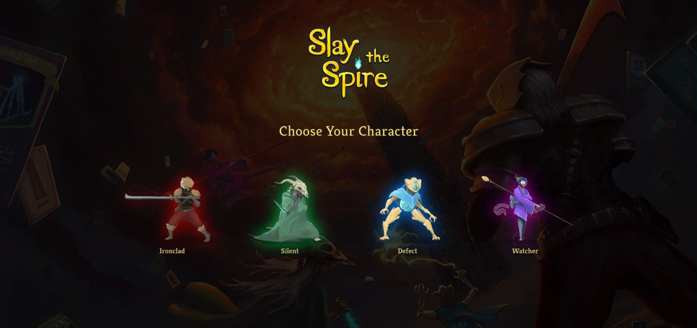
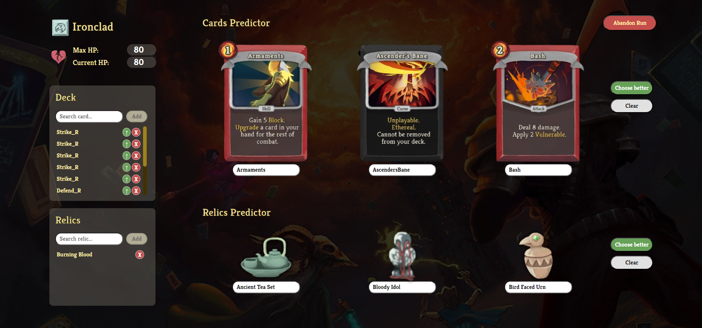

# 🃏 Slay the Spire Predictor

Este proyecto predice las mejores opciones de cartas y reliquias en el juego *Slay the Spire* utilizando modelos de regresión entrenados con datos específicos de cada personaje.

## 📂 Estructura del Proyecto

### 🔍 Machine Learning
Contiene los scripts para el análisis exploratorio, web scraping y la creación de los datasets de los combates de cada personaje.

- **EDA**: Incluye diccionarios de cada personaje con sus cartas, reliquia inicial, vida inicial, etc. Además, contiene el análisis exploratorio y una prueba rápida de entrenamiento y predicción de un modelo de regresión.
  
- **Load_data**: Contiene los scripts de web scraping que extraen de la wiki del juego todas las imágenes de las cartas y reliquias. También incluye un script con funciones para crear datasets completamente limpios y preparados con las variables deseadas.

### 🏋️ Trainer
Incluye el script que entrena el modelo de regresión para cada personaje y lo exporta para poder cargarlo posteriormente en la Webapp.

### 🌐 Webapp
Contiene todo lo necesario para que la interfaz de la web y el servidor funcionen conjuntamente.

- **🎨 css**: Contiene el estilo de la web.
  
- **🖼️ imagenes_extra**: Incluye imágenes sueltas (como el logo).

- **💻 flask**: Script del servidor que recibe peticiones desde JavaScript. Según el personaje elegido, carga su modelo correspondiente y realiza predicciones basadas en 4 listas de cartas o reliquias, mostrando en la web los valores que facilitan la elección.

- **📜 js**: Contiene todas las funciones de la web, incluidas las que envían peticiones POST a nuestro servidor Flask. También incluye diccionarios de personajes con sus cartas y reliquias.

- **🏠 index.html**: Página de inicio de la web donde se escoge el personaje.

  

- **📊 main.html**: Dashboard principal donde se muestran las características iniciales del personaje. Permite actualizar la vida y las cartas para hacer predicciones basadas en la situación de la partida.

  

## 🚀 Instalación

1. Clona este repositorio.
2. Instala las dependencias necesarias con `pip install -r requirements.txt`.
3. Ejecuta el servidor Flask: `python flask/app.py`.
4. Abre `index.html` en tu navegador para comenzar.

## 🎬 Demo

(Para que funcione, antes tienes que descargar todo lo que se encuentra en este [enlace](https://drive.google.com/drive/folders/1M2ZNTsTnOEzqEcOLdyMrnvnXELKaMFMp) y ejecutar el archivo app.py)
Una vez tengas los archivos necesarios, puedes ver una demo del proyecto [aquí](https://slaythespirepredictor1.on.drv.tw/Bootcamp/Proyecto_Final/Webapp/).

---

¡Gracias por usar *Slay the Spire Predictor*! 🎮
